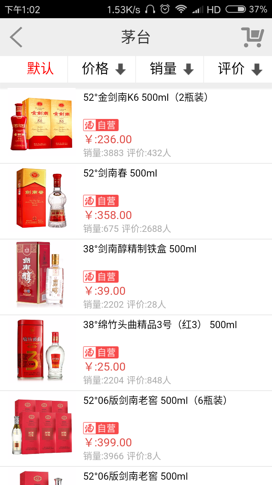

## 1. 项目简介
**项目描述:**

1. 基于vue+webpack+zepto的酒类移动销售网站项目

**功能模块：**

1. 首页包含活动轮播图，通过路由跳转到活动页面；
2. 提供酒类详细分类，每一类均包含子类，嵌套路由到对应的列表页面；
3. 列表页面实现按销量、评价等规则排序，每种酒路由到该酒详细信息页面；
4. 支持购物车和收藏功能，并设置登陆页面，提供社区模块可查看热门文章。

**技术要点：**

1. 参考vue全家桶，搭建基于webpack的开发环境；
2. 利用vue所擅长构建单页面的功能，快速构建项目各个模块，将公共模板导入到各模块中；
3. 使用vue路由控制页面跳转，使用嵌套路由技术控制子路由跳转，解决跳转后的默认页面和激活路由样式问题；
4. 对于需要传值的页面使用编程式导航进行传值，部分页面使用sessionStorage进行传值；
5. 使用webpack行模块化打包，使用git进行版本控制。

## 2. 项目运行
**谷歌浏览器运行**

$ npm install

$ npm run s

**打包apk运行**

将www文件夹拷贝到Hbuilder运行，或打包成安装包在手机上运行

## 3. 效果图
### 启动图 

### 首页

### 分类

### 列表

### 活动

### 社区

### 商品详情

### 购物车






